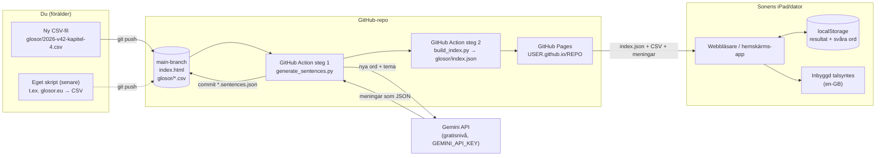

# Glosförhör

En glosförhörsapp utan reklam. Den består av en enda HTML-sida som hostas gratis på GitHub Pages. Glosorna ligger som CSV-filer i mappen `glosor/`, och när du pushar en ny fil dyker listan upp i appen inom någon minut. Gemini (gratisnivån) skriver dessutom en exempelmening per glosa, i ett tema som du väljer per lista.

## Arkitektur



- **Ingen server och ingen databas.** Appen läser `glosor/index.json`, sedan den CSV-fil som väljs och, om den finns, tillhörande `.sentences.json`.
- **Gemini anropas bara i GitHub Action**, aldrig från appen. API-nyckeln ligger som GitHub Secret och syns inte för den som öppnar sidan. Bara ord som saknar mening skickas (och ord i en lista vars tema du har ändrat), så varje ord genereras normalt en gång.
- **Resultaten sparas bara på enheten** (i webbläsarens localStorage). Om han byter enhet eller rensar webbläsardatan börjar statistiken om från noll.
- **Uppläsningen** använder enhetens inbyggda talsyntes (Web Speech API), så det behövs varken API-nyckel eller nätverk för ljudet.

## Övningslägen

| Läge | Hur det fungerar |
|---|---|
| ✏️ Skriv svaret | Klassiskt förhör. Fel svar kommer tillbaka senare i rundan tills alla sitter. Små stavfel ger "Nästan!" och visar rätt stavning. |
| 🔘 Flerval | Välj rätt bland fyra alternativ från samma lista. |
| 🃏 Flashcards | Vänd kortet och svara "Kunde" eller "Kunde inte". De kort han inte kunde kommer tillbaka. |
| 🧠 Memory | Para ihop svenska och engelska ord (8 par). Poängen är antal försök. |
| 🎧 Hörförhör | Hör det engelska ordet och stava det. "Ledtråd" visar den svenska betydelsen. |
| 🧩 Lucktext | Meningen visas med en lucka där glosan ska stå. Den svenska betydelsen visas som ledtråd. Skriver han rätt ord i fel form ("read" när det ska vara "reads") får han "Rätt ord! Men i meningen ska det stå …". Läget visas bara för listor som har meningar. |

Om en lista har meningar visas meningen (med svensk översättning och 🔊) efter varje svar, under flashcardet när det vänts och i ordlistan.

Det finns också några inställningar:

- **Riktning:** Sv → Eng, Eng → Sv eller blandat.
- **Automatisk uppläsning:** engelska ord läses upp av sig själva.
- **Sträng stavning:** när den är på räknas även "nästan rätt" som fel.
- **Svåra ord:** ord han har missat samlas per lista och kan övas separat.

## CSV-format

```csv
# titel: Djur på bondgården
svenska;engelska
häst;horse
tupp;rooster|cock
läsa;(to) read
```

| Regel | Förklaring |
|---|---|
| Filnamn | `ÅÅÅÅ-vVV-namn.csv` eller `ÅÅÅÅ-MM-DD-namn.csv`. Listorna sorteras med senaste först. |
| `# titel: …` | Valfri. Om raden saknas skapas titeln från filnamnet (`2026-v41-djur.csv` blir "Djur"). |
| `# tema: …` | Valfri. Tema för exempelmeningarna i den här listan, t.ex. `# tema: äldreboende och vardag`. Utan tema blir det vardagliga meningar. |
| Rubrikrad | Valfri: `svenska;engelska`. |
| Avgränsare | `;`, `,` eller tab. Appen känner av vilken som används på första raden. Excel med svenska inställningar sparar med `;`. |
| Flera rätta svar | Separera med `\|`, till exempel `rubber\|eraser`. Det första alternativet visas i flerval och memory. |
| Valfri del | Sätt den inom parentes: `(to) read` godkänner både "read" och "to read". |
| Teckenkodning | UTF-8 (å, ä, ö). |

Kolumn 1 är frågespråket (svenska) och kolumn 2 är svarsspråket (engelska). Språken ställs in i `CONFIG` högst upp i skriptet i `index.html` om ni senare vill lägga till t.ex. tyska.

## Exempelmeningar med Gemini

### Tema: `# tema:` i CSV-filen

Temat sätts per lista, så att det kan följa kapitlet i boken. Skriv till exempel `# tema: äldreboende och vardag` överst i CSV-filen. Ju mer konkret, desto bättre ("skördetröskor, balpressar och mjölkkor" fungerar bättre än "John Deere-traktorer", eftersom prompten undviker varumärken). Om en glosa inte passar temat skriver Gemini en vardaglig mening i stället för en krystad. Saknas raden blir alla meningar vardagliga.

### Inställningar: `sentences_config.json`

```json
{
  "learner": "svensk elev i årskurs 5, nybörjare i engelska (ungefär CEFR A1–A2)",
  "max_words": 12,
  "model": "gemini-3.5-flash"
}
```

| Fält | Betydelse |
|---|---|
| `learner` | Nivån. Påverkar hur enkla orden och grammatiken blir. |
| `max_words` | Ungefärlig maxlängd per mening. |
| `model` | Gemini-modell. Google byter namn ofta, se [modellistan](https://ai.google.dev/gemini-api/docs/models) och välj en Flash-modell som ingår i gratisnivån. |

### Resultatet: `glosor/<namn>.sentences.json`

```json
{
  "sv": "leverera",
  "en": "deliver",
  "sentence_en": "They deliver fresh flowers to the lobby every Monday.",
  "sentence_sv": "De levererar färska blommor till entrén varje måndag.",
  "target": "deliver",
  "theme": "äldreboende och vardag",
  "locked": false
}
```

- **Rätta en mening:** redigera filen direkt på GitHub och sätt `"locked": true`, så skrivs den aldrig över.
- **Byta tema för en befintlig lista:** ändra `# tema:` i CSV-filen och pusha. Listans olåsta meningar görs då om automatiskt med det nya temat. Tar du bort raden blir de vardagliga.
- **Få nya varianter av alla meningar:** *Actions* → *Publicera glosappen* → *Run workflow* och kryssa i **regenerate**. Då görs alla olåsta meningar om, även de som redan har rätt tema.
- `target` är exakt den form som står i meningen. Det är den som blankas i Lucktext. Skriptet kontrollerar att den finns i meningen och ber Gemini en gång till om något inte stämmer.
- Om Gemini krånglar (fel nyckel, gratiskvoten slut) publiceras appen ändå. Steget markeras med en varning i Actions, och listan saknar meningar tills nästa körning.

## Komma igång

1. **Skapa ett repo** på GitHub, t.ex. `glosor`. Det måste vara publikt för gratis GitHub Pages. Glosorna blir alltså offentliga, men de innehåller inget personligt.
2. **Pusha innehållet** i den här mappen:
   ```bash
   cd glosapp
   git init -b main
   git add .
   git commit -m "Glosförhör"
   git remote add origin git@github.com:<user>/glosor.git
   git push -u origin main
   ```
3. **Slå på Pages:** gå till repot → *Settings* → *Pages* → *Build and deployment* → *Source*: **GitHub Actions**.
4. **Skapa en Gemini-nyckel:** logga in på [aistudio.google.com](https://aistudio.google.com) med ditt Google-konto → **Get API key** → *Create API key*. Det kostar inget på gratisnivån och kräver inget betalkort. Observera att Google enligt villkoren för gratisnivån kan använda innehållet (här bara glosor) för att förbättra sina produkter.
5. **Lägg nyckeln i repot:** *Settings* → *Secrets and variables* → *Actions* → **New repository secret**. Namn: `GEMINI_API_KEY`, värde: nyckeln.
6. **Ge workflowen skrivrätt** (så att den kan committa meningarna): *Settings* → *Actions* → *General* → *Workflow permissions* → **Read and write permissions** → *Save*.
7. **Kör workflowen:** *Actions* → *Publicera glosappen* → *Run workflow*. Den tar 1–2 minuter. Därefter ligger `*.sentences.json` i `glosor/`, och adressen är `https://<user>.github.io/glosor/`.
8. **Lägg appen på hemskärmen** på sonens iPad: öppna adressen i Safari → Dela → *Lägg till på hemskärmen*. Då öppnas den i helskärm som en vanlig app.

## Lägga till en ny glosvecka

```bash
# skapa filen (eller exportera från Excel som CSV med ;)
code glosor/2026-v42-kapitel-4.csv
git add glosor/2026-v42-kapitel-4.csv
git commit -m "Glosor v42"
git push
```

Workflowen genererar meningar för de nya orden, committar dem, bygger `glosor/index.json` och publicerar på nytt. Du behöver aldrig redigera `index.json` för hand. Gör `git pull` innan du lägger till nästa lista, eftersom workflowen har committat meningsfilen.

**Testa lokalt:**

```bash
export GEMINI_API_KEY=...            # valfritt – utan nyckel hoppas meningarna över
python scripts/generate_sentences.py
python scripts/build_index.py
python -m http.server 8000           # öppna http://localhost:8000
```

## Filer

```
glosapp/
├── index.html                  # hela appen (HTML + CSS + JS, inga beroenden)
├── manifest.webmanifest        # gör att den kan installeras på hemskärmen
├── sentences_config.json       # nivå, längd och modell för exempelmeningarna
├── icon.svg, icon-192.png, icon-512.png
├── glosor/
│   ├── 2026-v40-skolan.csv     # exempel
│   ├── 2026-v41-djur.csv       # exempel
│   ├── *.sentences.json        # genereras av Gemini – får redigeras (sätt "locked": true)
│   └── index.json              # genereras – skrivs över av workflowen
├── scripts/
│   ├── glos_csv.py             # gemensam CSV-inläsning
│   ├── generate_sentences.py   # Gemini → *.sentences.json (bara nya ord)
│   └── build_index.py          # bygger index.json
└── .github/workflows/pages.yml # meningar → commit → index → GitHub Pages
```

## Möjliga nästa steg

- **Skript för glosor.eu → CSV.** Lärarens övningssidor (`glosor.eu/ovning/<namn>.<id>.html`) visar hela listan utan inloggning, så ett litet skript kan hämta sidan, plocka ut ordparen och pusha en CSV.
- **Se resultaten från din dator.** Det kräver en liten backend, t.ex. en Supabase-tabell eller en Azure Function, som appen skickar rundresultat till.
