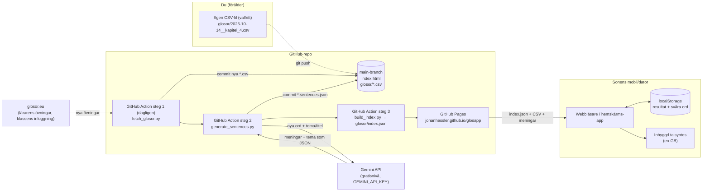

# Glosförhör

En glosförhörsapp utan reklam. Den består av en enda HTML-sida som hostas gratis på GitHub Pages. Glosorna ligger som CSV-filer i mappen `glosor/`. En GitHub Action hämtar varje dag lärarens nya övningar från glosor.eu och gör om dem till CSV, men du kan också lägga till filer själv. Gemini (gratisnivån) skriver en exempelmening per glosa, i ett tema som du väljer per lista eller som Gemini väljer utifrån kapitlet.

**Appen:** <https://johanhessler.github.io/glosapp/>

## Arkitektur



- **Ingen server och ingen databas.** Appen läser `glosor/index.json`, sedan den CSV-fil som väljs och, om den finns, tillhörande `.sentences.json`.
- **glosor.eu och Gemini anropas bara i GitHub Action**, aldrig från appen. API-nyckeln och klassens inloggning ligger som GitHub Secrets och syns inte i repot eller för den som öppnar sidan. Bara ord som saknar mening skickas (och ord i en lista vars tema du har ändrat), så varje ord genereras normalt en gång.
- **Resultaten sparas bara på enheten** (i webbläsarens localStorage). Om han byter enhet eller rensar webbläsardatan börjar statistiken om från noll.
- **Uppläsningen** använder enhetens inbyggda talsyntes (Web Speech API), så det behövs varken API-nyckel eller nätverk för ljudet.

## Övningslägen

| Läge | Hur det fungerar |
|---|---|
| ✏️ Skriv svaret | Klassiskt förhör. Fel svar kommer tillbaka senare i rundan tills alla sitter. Små stavfel ger "Nästan!" och visar rätt stavning. |
| 🔘 Flerval | Välj rätt bland fyra alternativ från samma lista. |
| 🃏 Flashcards | Vänd kortet och svara "Kunde" eller "Kunde inte". De kort han inte kunde kommer tillbaka. |
| 🧠 Memory | Para ihop svenska och engelska ord (8 par). Poängen bygger på antal försök (8 par på 8 försök = 100 %). |
| 🎧 Hörförhör | Hör det engelska ordet och stava det. "Ledtråd" visar den svenska betydelsen. |
| 🧩 Lucktext | Meningen visas med en lucka där glosan ska stå. Den svenska betydelsen visas som ledtråd. Skriver han rätt ord i fel form ("read" när det ska vara "reads") får han "Rätt ord! Men i meningen ska det stå …". Läget visas bara för listor som har meningar. |

Om en lista har meningar visas meningen (med svensk översättning och 🔊) efter varje svar, under flashcardet när det vänts och i ordlistan.

Det finns också några inställningar:

- **Riktning:** Sv → Eng, Eng → Sv eller blandat.
- **Automatisk uppläsning:** engelska ord läses upp av sig själva.
- **Sträng stavning:** när den är på räknas även "nästan rätt" som fel.
- **Svåra ord:** ord han har missat samlas per lista och kan övas separat.

Under 📊 (uppe till höger på startsidan) finns resultaten per lista. De kan nollställas där.

## CSV-format

```csv
# titel: Forever Young
# tema: äldreboende och vardag
svenska;engelska
sjuksköterska;nurse
rullator;walking frame
suddgummi;rubber|eraser
läsa;(to) read
```

| Regel | Förklaring |
|---|---|
| Filnamn | `ÅÅÅÅ-MM-DD__namn.csv`, t.ex. `2026-10-07__forever_young.csv`. `ÅÅÅÅ-vVV-namn.csv` fungerar också, men blanda inte formaten: listorna sorteras på filnamnet, senaste först, och då hamnar v-filerna alltid överst. |
| `# titel: …` | Valfri. Om raden saknas skapas titeln från filnamnet (`2026-10-07__forever_young.csv` blir "Forever young"). |
| `# tema: …` | Valfri. Tema för exempelmeningarna i den här listan, t.ex. `# tema: äldreboende och vardag`. Utan raden väljer Gemini ett tema. |
| `# källa: …` | Skrivs av hämtningen från glosor.eu (övningens adress). Används för att inte hämta samma övning två gånger. |
| Rubrikrad | Valfri: `svenska;engelska`. |
| Avgränsare | `;`, `,` eller tab. Appen känner av vilken som används på första raden. Excel med svenska inställningar sparar med `;`. |
| Flera rätta svar | Separera med `\|`, till exempel `rubber\|eraser`. Det första alternativet visas i flerval och memory. |
| Valfri del | Sätt den inom parentes: `(to) read` godkänner både "read" och "to read". |
| Teckenkodning | UTF-8 (å, ä, ö). |

Kolumn 1 är frågespråket (svenska) och kolumn 2 är svarsspråket (engelska). Språken ställs in i `CONFIG` högst upp i skriptet i `index.html` om ni senare vill lägga till t.ex. tyska.

## Exempelmeningar med Gemini

### Tema: `# tema:` i CSV-filen

Temat sätts per lista, så att det kan följa kapitlet i boken. Skriv till exempel `# tema: äldreboende och vardag` överst i CSV-filen. Ju mer konkret, desto bättre ("skördetröskor, balpressar och mjölkkor" fungerar bättre än "John Deere-traktorer", eftersom prompten undviker varumärken). Om en glosa inte passar temat skriver Gemini en vardaglig mening i stället för en krystad.

**Saknas raden väljer Gemini ett tema** utifrån listans titel och orden, i samma anrop som meningarna skrivs. Temat sparas i meningsfilen (`"theme_auto": true`) och används även för ord som läggs till senare. Skriver du ett eget `# tema:` senare tar det över, och meningarna görs om. Vill du ha vardagliga meningar skriver du `# tema: vardag`.

### Inställningar: `sentences_config.json`

```json
{
  "learner": "svensk elev i årskurs 5, nybörjare i engelska (ungefär CEFR A1–A2)",
  "max_words": 12,
  "model": "gemini-3.8-flash",
  "fallback_model": "gemini-3.5-flash"
}
```

| Fält | Betydelse |
|---|---|
| `learner` | Nivån. Påverkar hur enkla orden och grammatiken blir. |
| `max_words` | Ungefärlig maxlängd per mening. |
| `model` | Gemini-modell. Google byter namn ofta, se [modellistan](https://ai.google.dev/gemini-api/docs/models) och välj en Flash-modell som ingår i gratisnivån. |
| `fallback_model` | Reservmodell för sista omförsöket när `model` är överbelastad. Tom sträng = ingen reserv. |

### Resultatet: `glosor/<namn>.sentences.json`

```json
{
  "sv": "leverera",
  "en": "deliver",
  "sentence_en": "They deliver fresh flowers to the lobby every Monday.",
  "sentence_sv": "De levererar färska blommor till entrén varje måndag.",
  "target": "deliver",
  "theme": "äldreboende och vardag",
  "theme_auto": false,
  "locked": false
}
```

- **Rätta en mening:** redigera filen direkt på GitHub och sätt `"locked": true`, så skrivs den aldrig över.
- **Byta tema för en befintlig lista:** ändra `# tema:` i CSV-filen och pusha. Listans olåsta meningar görs då om automatiskt med det nya temat. Tar du bort raden väljer Gemini ett nytt.
- **Få nya varianter av alla meningar:** *Actions* → *Publicera glosappen* → *Run workflow* och kryssa i **regenerate**. Då görs alla olåsta meningar om, även de som redan har rätt tema.
- `target` är exakt den form som står i meningen. Det är den som blankas i Lucktext. Skriptet kontrollerar att den finns i meningen och ber Gemini en gång till om något inte stämmer.
- Gratisnivån svarar ofta "hög belastning" (503) eller "för många anrop" (429). Skriptet skickar en hel lista per anrop och väntar då 15 s, 30 s, 60 s och sedan 120 s åt gången, upp till ungefär 10 minuter. Sista försöket görs med `fallback_model`. Det som lyckas sparas. Ord som fortfarande saknar mening tas med vid nästa körning, senast vid den dagliga körningen.
- Om Gemini krånglar (fel nyckel, gratiskvoten slut) publiceras appen ändå. Steget markeras med en varning i Actions.

## Automatisk hämtning från glosor.eu

Workflowen körs varje dag kl. 16 (svensk sommartid, 15 vintertid). Då loggar `scripts/fetch_glosor.py` in med klassens konto, läser listan över övningar och skriver en CSV för varje övning som inte redan finns, t.ex. `2026-10-07__forever_young.csv` med titeln "Forever Young". Gemini väljer tema och skriver meningar, botten committar allt och appen publiceras. Du behöver alltså inte göra något, men kör `git pull` innan du ändrar något lokalt.

- **Kör direkt** i stället för att vänta: *Actions* → *Publicera glosappen* → *Run workflow*.
- **Ändra tiden:** `cron` i `.github/workflows/pages.yml` (UTC).
- **Rätta en hämtad lista** (t.ex. ett stavfel från läraren): redigera CSV-filen och pusha. Filen hämtas inte igen eftersom raden `# källa:` finns kvar.
- **Lokalt:** `python scripts/fetch_glosor.py --dry-run` visar vad som skulle hämtas. Inloggningen läses då från `local/.env` (git-ignorerad):
  ```
  GLOSOR_EU_USER=...
  GLOSOR_EU_PASS=...
  ```
- Om glosor.eu krånglar eller ändrar sidornas struktur publiceras appen ändå. Steget får en varning i Actions.

## Uppsättning

Repot [johanhessler/glosapp](https://github.com/johanhessler/glosapp) är redan uppsatt. Stegen nedan behövs bara om det ska göras om, t.ex. i ett nytt repo.

1. **Publikt repo** på GitHub. Det krävs för gratis GitHub Pages, så glosorna är offentliga, men de innehåller inget personligt. `CLAUDE.md` och `.claude/` är git-ignorerade och hamnar aldrig i repot.
2. **Pages:** *Settings* → *Pages* → *Build and deployment* → *Source*: **GitHub Actions**.
3. **Gemini-nyckel:** logga in på [aistudio.google.com](https://aistudio.google.com) → **Get API key** → *Create API key*. Gratisnivån kräver inget betalkort. Enligt villkoren kan Google använda innehållet (här bara glosor) för att förbättra sina produkter.
4. **Secrets:** *Settings* → *Secrets and variables* → *Actions* → **New repository secret**: `GEMINI_API_KEY`, `GLOSOR_EU_USER` och `GLOSOR_EU_PASS`. De två sista kan också sättas från `local/.env` med `gh secret set -f local/.env`.
5. **Skrivrätt för workflowen** (så att den kan committa glosor och meningar): *Settings* → *Actions* → *General* → *Workflow permissions* → **Read and write permissions**.
6. **Kör workflowen:** *Actions* → *Publicera glosappen* → *Run workflow*. Den tar 1–2 minuter.
7. **Hemskärmen** på sonens iPhone: öppna adressen i Safari → Dela → *Lägg till på hemskärmen*. Då öppnas den i helskärm som en vanlig app. På Chromebook: öppna adressen i Chrome och installera den som app via menyn ⋮ (exakt menytext varierar mellan Chrome-versioner).

## Lägga till en egen lista

Listor från glosor.eu kommer automatiskt. Vill du lägga till en egen:

```bash
git pull                                  # botten har committat glosor och meningar sedan sist
code glosor/2026-10-14__kapitel_4.csv     # eller exportera från Excel som CSV med ;
git add glosor/2026-10-14__kapitel_4.csv
git commit -m "Glosor kapitel 4"
git push
```

Workflowen genererar meningar för de nya orden, committar dem (`[skip ci]`), bygger `glosor/index.json` och publicerar på nytt. Efter 1–2 minuter syns listan i appen. Du behöver aldrig redigera `index.json` för hand.

**Testa lokalt:**

```bash
python scripts/fetch_glosor.py --dry-run   # kräver local/.env, annars hoppas den över
export GEMINI_API_KEY=...            # valfritt – utan nyckel hoppas meningarna över
python scripts/generate_sentences.py
python scripts/build_index.py
python -m http.server 8000           # öppna http://localhost:8000
```

## Filer

```
glosapp/
├── index.html                  # hela appen (HTML + CSS + JS, inga beroenden)
├── manifest.webmanifest        # gör att den kan installeras på hemskärmen
├── sentences_config.json       # nivå, längd och modell för exempelmeningarna
├── icon.svg, icon-192.png, icon-512.png
├── .gitignore                  # CLAUDE.md, .claude/, local/, _site/, __pycache__/
├── local/                      # git-ignorerad: .env med glosor.eu-inloggning, sparade sidor
├── glosor/
│   ├── 2026-10-07__forever_young.csv  # en övning = en CSV
│   ├── *.sentences.json        # genereras av Gemini – får redigeras (sätt "locked": true)
│   └── index.json              # genereras – skrivs över av workflowen
├── scripts/
│   ├── fetch_glosor.py         # glosor.eu → nya *.csv
│   ├── glos_csv.py             # gemensam CSV-inläsning
│   ├── generate_sentences.py   # Gemini → *.sentences.json (nya ord, ändrat tema, ev. tema)
│   └── build_index.py          # bygger index.json
└── .github/workflows/pages.yml # (dagligen) hämta → meningar → commit → index → Pages
```

## Kända begränsningar

- **Ordförslag på Android:** Gboard visar ordförslag i svarsfälten trots att sidan ber om att slippa dem. iPhone och iPad respekterar inställningen.
- **Resultaten följer inte med** mellan enheter, t.ex. mellan iPhone och Chromebook (se nästa steg).

## Möjliga nästa steg

- **Se resultaten från din dator.** Det kräver en liten backend, t.ex. en Supabase-tabell eller en Azure Function, som appen skickar rundresultat till.
